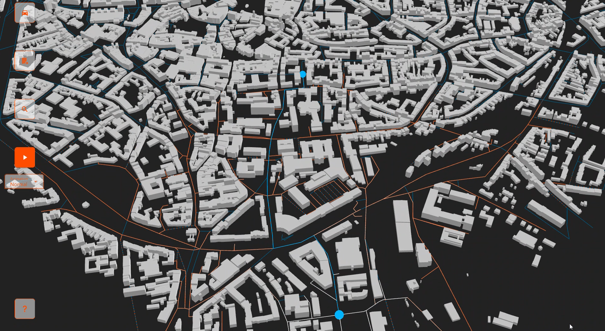
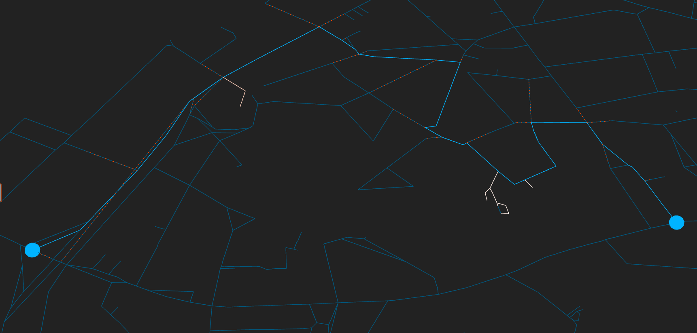

# OSM Pathfinding Visualizer 3D


This project allows you to visualize common search algorithms on a 3D model generated from OpenStreetMap data. The default city is Aachen, Germany.  
You can try it at: https://jesseger.github.io/OSM_pathfinding_visualizer_3D/.  
Note: initially loading the road ("edges") may take a while, depending on your specs.



## How to use
You navigate using Left Click (pan) and Right Click (rotate).
Click the "?" button for further explanations.

## How to run locally
First, install the dependencies:
```sh
npm install
```
Then run the application:
```sh
npm run dev
```

## Supplying your own GeoJson
If you'd like to use another town, you can make use of the [Overpass API](https://overpass-turbo.eu/). Simply paste the following query and change the four bounding box coordinates to your liking. 

```
[out:json][timeout:30][bbox:50.7642, 6.0688, 50.7832, 6.0983];(
  way["building"];
  way["building:part"];
  relation["building"]["type"="multipolygon"];
  way["highway"];
);out;>;out qt;
```

Then press Export > GeoJson > Download and place the resulting file at './public/assets/buildings_highways.geojson'.

> ⚠️ For now, only buildings, roads and walkable paths are modeled. In particular, no railroads, no trees and no water.

## Search algorithms
You can choose between:
- A*
- Dijkstra's algorithm
- Breadth-First-Search
- Greedy Best-First-Search

BFS is _unweighted_, so it will minimize the number of edges used to get to the goal. Since these are all of different lengths — especially because OSM mapping is often inconsistent — this concept of a shortest path is not very useful here.

It was eye-opening to see just how poor the greedy algorithm performs. Unless it reaches a dead end / a node where every edge moves away from the goal, **every decision is essentially final**. This often means after one "bad" decision, the algorithm has to take a very long detour (see image, left to right).


